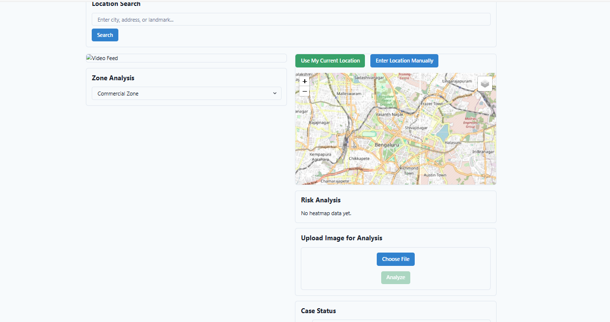

<p align="center">
  
</p>

# 🔥 Real-Time Fire Segmentation

A deep learning-based application for detecting and segmenting fire in real-time video streams. This project uses image processing and semantic segmentation techniques to isolate fire regions, ideal for early warning systems and surveillance. 

## 🚀 Features

- Real-time fire detection and segmentation
- Live video feed with overlay visualization
- Emergency response status panel
- Performance metrics monitoring

## 🧰 Tech Stack

- Python
- OpenCV
- TensorFlow / PyTorch (based on your code)
- NumPy


## 🖼️ Screenshots

### 👤 User Side

#### 🏠 Home Page

---

### 🛠 Admin Side

#### 📊 Admin Home Page


#### 📁 Detection Logs


## Installation

1. Clone this repository
2. Install dependencies:
```bash
pip install -r requirements.txt
```

## Usage

1. Start the application:
```bash
python app.py
```

```
Navigate to the frontend path and paste the cd ./frontend path :-
Run npm install 
npm run dev
```

2. Open a web browser and navigate to:
```
http://localhost:5000
```

## System Requirements

- Python 3.7+
- Webcam or video input device
- CUDA-capable GPU (recommended for real-time performance)

## Notes

- The system is designed for real-time monitoring and should be used as part of a comprehensive emergency response system

👨‍💻 Developer Shivaraj N Kengannavar Email: shivarajnkengannavar@gmail.com

🙌 Contributing
We welcome contributions! Whether it’s reporting bugs, discussing improvements, or submitting pull requests — every bit helps!

Fork the repository

Create a new branch (git checkout -b feature/YourFeature)

Commit your changes (git commit -m 'Add your message')

Push to the branch (git push origin feature/YourFeature)

Open a Pull Request


                   "Thank you for stopping by and exploring this project — your interest and support mean a lot!" 
